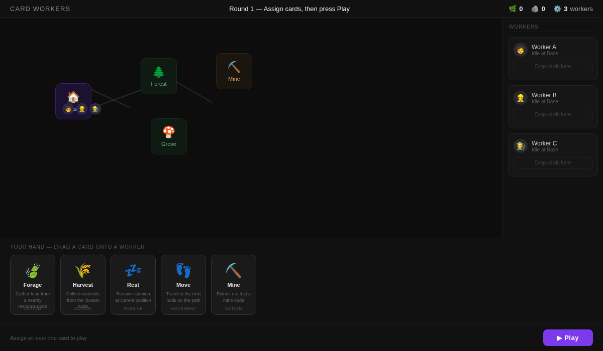
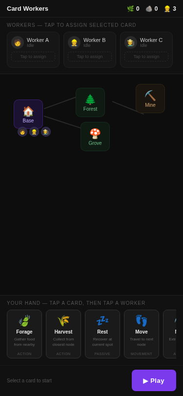

# Card Workers — Design Document

*Last updated: June 2026. Brainstorming phase — no code yet.*

---

## Concept

**Card Workers** is a browser game prototype for [hermes-gamelab](https://grigorysolomatov.github.io/hermes-gamelab/).

It shares DNA with the Automaton game — workers, cards, a map — but flips the deck mechanic. Instead of each worker owning their own deck, there is **one shared deck** for the player, Slay the Spire style. You draw a hand, assign cards to workers by dragging, and hit Play.

---

## Core Loop

1. Player draws a hand of cards from the shared deck.
2. Player drags cards onto workers to assign actions (queue them up).
3. On **Play**, all workers execute simultaneously — each cycling through their assigned cards in a loop.
4. Workers keep looping indefinitely until the round ends (end condition TBD).

---

## Interface

- **Drag card → drop on worker** = assign that card's action to that worker.
- Cards execute in the order they were assigned to each worker. Order matters.
- Freely reassign / undo until Play is pressed. No commitment before Play.
- Paradigm mirrors Automaton's drag-onto-resource-node interaction, but the target is now the worker itself.

---

## Cards

| Card | Effect |
|------|--------|
| **Forage** | Worker goes and forages from a nearby resource. |
| *(more TBD)* | |

- A card can only be assigned to one worker at a time (implied by shared deck).

---

## Interface Sketches

### Desktop

*Start-of-round layout — before Play is pressed.*

**Key areas:**
- **Top bar** — round label, resource counters
- **Map (centre-left)** — nodes (Base, Forest, Grove, Mine) with worker tokens idle at Base
- **Workers panel (right)** — one slot per worker; drag cards here to queue actions; ✕ to unassign
- **Hand (bottom)** — your full hand of cards; drag any card onto a worker
- **Play bar** — shows assignment count; big Play button commits the round

### Mobile (375px)

*Two-tap interaction: tap a card to select it, then tap a worker to assign.*

**Mobile adaptations:**
- **Workers strip** — horizontal scroll across the top; tap a worker after selecting a card
- **Map** — compact centre area; nodes still visible for spatial context
- **Hand** — horizontal scroll at the bottom; tap to select (card lifts), tap again to deselect
- **Assign banner** — purple top banner appears when a card is selected: "Tap a worker to assign"
- **Play bar** — full-width at the bottom, same as desktop

## Prototype Scope (v1)

- Single round. No end condition — just explore the interaction feel.
- Workers loop their card queue indefinitely once Play is pressed.
- No deck/discard mechanics yet.

---

## Open Questions

- What triggers end of round / level?
- Do cards return to hand after a round, or stay assigned?
- How many workers? How many cards in hand?
- What other card types beyond Forage?
- What does the map look like — same node-based map as Automaton, or something new?

---

## Relationship to Automaton

| | Automaton | Card Workers |
|-|-----------|--------------|
| Deck | One per worker | One shared deck |
| Assignment | Card → resource node | Card → worker |
| Execution | Loop | Loop (simultaneous) |
| Interface | Drag card onto node | Drag card onto worker |
